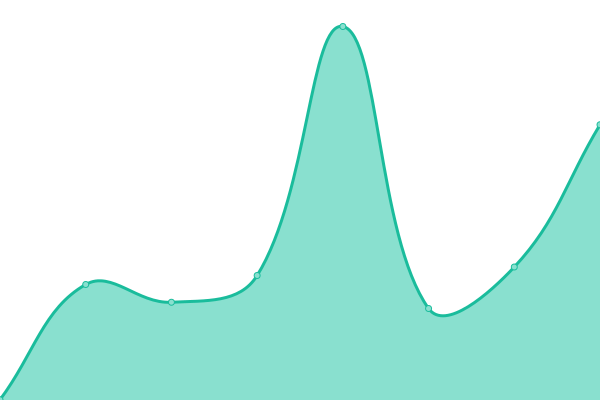

# [📈 Live Status](https://magape-io.github.io/upptime): <!--live status--> **🟧 Partial outage**

This repository contains the open-source uptime monitor and status page for [MagApe](https://magape.io), powered by [Upptime](https://github.com/upptime/upptime).

With [Upptime](https://upptime.js.org), you can get your own unlimited and free uptime monitor and status page, powered entirely by a GitHub repository. We use [Issues](https://github.com/magape-io/upptime/issues) as incident reports, [Actions](https://github.com/magape-io/upptime/actions) as uptime monitors, and [Pages](https://magape-io.github.io/upptime) for the status page.

<!--start: status pages-->
<!-- This summary is generated by Upptime (https://github.com/upptime/upptime) -->
<!-- Do not edit this manually, your changes will be overwritten -->
<!-- prettier-ignore -->
| URL | Status | History | Response Time | Uptime |
| --- | ------ | ------- | ------------- | ------ |
|  [MagApe Mainnet](https://magape.io/) | 🟩 Up | [mag-ape-mainnet.yml](https://github.com/magape-io/upptime/commits/HEAD/history/mag-ape-mainnet.yml) | 

 474ms
     
 | 

<a href="https://upptime.magape.io/history/mag-ape-mainnet">100.00%</a>
    

|  [MagApe Testnet](https://testnet.magape.io/) | 🟩 Up | [mag-ape-testnet.yml](https://github.com/magape-io/upptime/commits/HEAD/history/mag-ape-testnet.yml) | 

 198ms
     
 | 

<a href="https://upptime.magape.io/history/mag-ape-testnet">100.00%</a>
    

|  [MagApe Dev](https://dev.magape.io/) | 🟥 Down | [mag-ape-dev.yml](https://github.com/magape-io/upptime/commits/HEAD/history/mag-ape-dev.yml) | 

 164ms
     
 | 

<a href="https://upptime.magape.io/history/mag-ape-dev">45.91%</a>
    

|  [BSC Mainnet Node](https://mainnet-api.magape.io/) | 🟩 Up | [bsc-mainnet-node.yml](https://github.com/magape-io/upptime/commits/HEAD/history/bsc-mainnet-node.yml) | 

 787ms
     
 | 

<a href="https://upptime.magape.io/history/bsc-mainnet-node">28.24%</a>
    

|  [BSC Testnet Node](https://testnet-api.magape.io/) | 🟩 Up | [bsc-testnet-node.yml](https://github.com/magape-io/upptime/commits/HEAD/history/bsc-testnet-node.yml) | 

 860ms
     
 | 

<a href="https://upptime.magape.io/history/bsc-testnet-node">6.03%</a>
    

|  [Dev Testnet Node 1](https://rpc.buildbear.io/full-elektra-e79169fa/) | 🟥 Down | [dev-testnet-node-1.yml](https://github.com/magape-io/upptime/commits/HEAD/history/dev-testnet-node-1.yml) | 

 566ms
     
 | 

<a href="https://upptime.magape.io/history/dev-testnet-node-1">92.39%</a>
    

|  [Dev Testnet Node 2](https://rpc.buildbear.io/miniature-husk-93484ab0/) | 🟥 Down | [dev-testnet-node-2.yml](https://github.com/magape-io/upptime/commits/HEAD/history/dev-testnet-node-2.yml) | 

 9ms
     
 | 

<a href="https://upptime.magape.io/history/dev-testnet-node-2">0.00%</a>
    

|  [Sepolia Testnet Node](https://sepolia-api.magape.io/) | 🟥 Down | [sepolia-testnet-node.yml](https://github.com/magape-io/upptime/commits/HEAD/history/sepolia-testnet-node.yml) | 

 815ms
     
 | 

<a href="https://upptime.magape.io/history/sepolia-testnet-node">0.00%</a>
    

|  [Host Server](https://jumper.magape.io) | 🟩 Up | [host-server.yml](https://github.com/magape-io/upptime/commits/HEAD/history/host-server.yml) | 

 1237ms
     
 | 

<a href="https://upptime.magape.io/history/host-server">99.16%</a>
    

|  [Contabo Server 1](http://c1.magape.io/) | 🟥 Down | [contabo-server-1.yml](https://github.com/magape-io/upptime/commits/HEAD/history/contabo-server-1.yml) | 

 0ms
     
 | 

<a href="https://upptime.magape.io/history/contabo-server-1">0.00%</a>
    

|  [Contabo Server 2](http://c2.magape.io/) | 🟥 Down | [contabo-server-2.yml](https://github.com/magape-io/upptime/commits/HEAD/history/contabo-server-2.yml) | 

 0ms
     
 | 

<a href="https://upptime.magape.io/history/contabo-server-2">0.00%</a>
    

|  [Contabo Server 3](http://api.magape.io/) | 🟩 Up | [contabo-server-3.yml](https://github.com/magape-io/upptime/commits/HEAD/history/contabo-server-3.yml) | 

 534ms
     
 | 

<a href="https://upptime.magape.io/history/contabo-server-3">100.00%</a>
    

<!--end: status pages-->

[**Visit our status website →**](https://magape-io.github.io/upptime)

## 📄 License

- Powered by: [Upptime](https://github.com/upptime/upptime)
- Code: [MIT](./LICENSE) © [Anand Chowdhary](https://anandchowdhary.com), supported by [Pabio](https://pabio.com)
- Data in the `./history` directory: [Open Database License](https://opendatacommons.org/licenses/odbl/1-0/)
